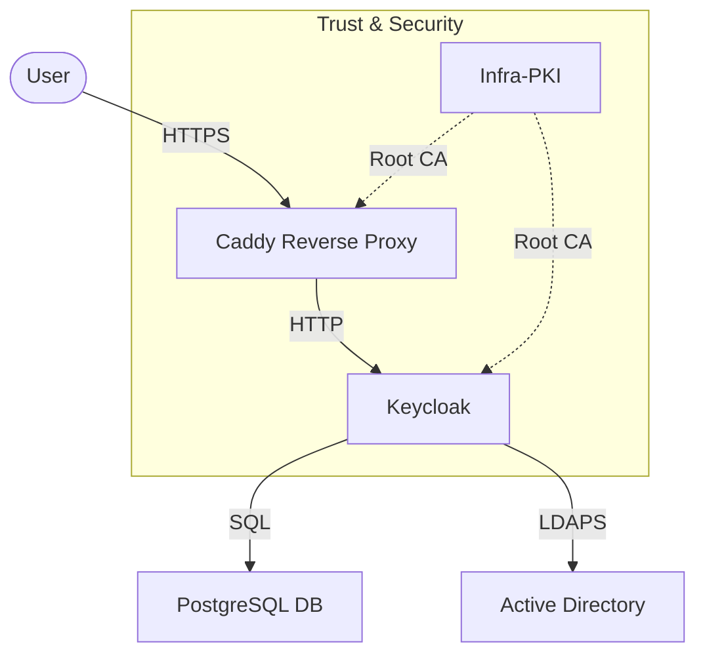

# Infra-IAM: Identity & Access Management

This component provides a centralized SSO (Single Sign-On) solution using **Keycloak**, secured by **Caddy** and integrated with Active Directory (AD) and the internal PKI.

## Architecture

## Services

| Service | Description | Credentials |
| :--- | :--- | :--- |
| **keycloak** | The Identity Provider (IdP) | Admin: `admin` / `${KC_ADMIN_PASSWORD}` |
| **db** | PostgreSQL backend for Keycloak | User: `keycloak` / `${DB_PASSWORD}` |
| **caddy** | TLS Termination & Reverse Proxy | Auto-managed Certificates |
| **setup** | Init container for fetching certs | Internal usage |
| **renewer** | Auto-renews internal certificates | Internal usage |

## Integrations

- **Infra-PKI**: The system trusts the internal Root CA to enable secure communication with other internal services.
- **Active Directory**: Integrated via LDAPS for user federation (requires `fetch_ad_cert.sh`).

## Usage Scenarios

### 1. Administrative Access

Access the Keycloak Administration Console to manage realms, clients, and users.
- **URL**: `https://sso.example.com`
- **Credentials**: `admin` / `<KC_ADMIN_PASSWORD>` relative to `.env`.

### 2. Validating Active Directory Connection

To ensure the LDAPS integration is working:

1. Log in to the Admin Console.
2. Navigate to **User Federation** -> **ldap**.
3. Click **Test Connection** (Tests network/port).
4. Click **Test Authentication** (Tests bind credentials).
5. *Note: If "Test Connection" fails, check `infra-iam` logs for "PKIX path building failed" which implies a certificate trust issue.*

### 3. Registering a New Application (OIDC Client)

To allow a service (e.g., Nextcloud, RStudio) to use Keycloak for login:

1. Go to **Clients** -> **Create Client**.
2. **Client ID**: `my-app` (e.g., `nextcloud`).
3. **Capability config**: Ensure "Standard Flow" (Authorization Code) is ON.
4. **Valid Redirect URIs**: `https://my-app.example.com/*`
5. **Credentials**: Go to the Credentials tab to copy the `Client Secret`.

### 4. Updating the Trust Store

If the PKI Root CA changes (re-init):

1. Run `scripts/infra-iam/configure_iam_pki.sh <new_env_file>`.
2. Restart the setup container to re-fetch the cert: `docker compose up -d setup`.
3. Restart Keycloak: `docker compose restart keycloak`.
