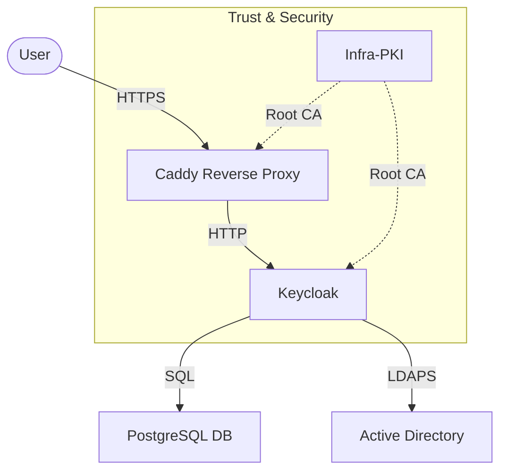

# Infra-IAM: Identity & Access Management

This component provides a centralized SSO (Single Sign-On) solution using **Keycloak**, secured by **Caddy** and integrated with Active Directory (AD) and the internal PKI.

## Architecture

```mermaid
graph TD
    User([User]) -->|HTTPS| Caddy[Caddy Reverse Proxy]
    Caddy -->|HTTP| Keycloak[Keycloak]
    Keycloak -->|SQL| Postgres[PostgreSQL DB]
    Keycloak -->|LDAPS| AD[Active Directory]
    
    subgraph "Trust & Security"
        PKI[Infra-PKI] -.->|Root CA| Keycloak
        PKI -.->|Root CA| Caddy
    end
```

## Services

| Service | Description | Credentials |
| :--- | :--- | :--- |
| **keycloak** | The Identity Provider (IdP) | Admin: `admin` / `${KC_ADMIN_PASSWORD}` |
| **db** | PostgreSQL backend for Keycloak | User: `keycloak` / `${DB_PASSWORD}` |
| **caddy** | TLS Termination & Reverse Proxy | Auto-managed Certificates |
| **iam-init** | Ephemeral Init container for fetching certs | Internal API |
| **renewer** | Auto-renews internal certs (Restarts Keycloak) | Internal API |
| **docker-socket-proxy** | Security proxy for docker.sock protecting host | Internal usage |

## Automated Management Stack

This service uses a **Sidecar Pattern** to automate lifecycle management:

### 1. Initialization Service (`iam-init`)

- **Status**: Ephemeral (Runs once at startup).
- **Role**: Bootstraps the environment.
- **Tasks**:
  - Creates required directories (`/certs`, `/data`).
  - Fixes permissions (`chown`) to match the non-root PUID/PGID.
  - Fetches the Root CA from `infra-pki`.
  - Fetches the Active Directory CA certificate.

### 2. Renew Service (`iam-renewer`)

- **Status**: Sidecar (Runs continuously).
- **Role**: Certificate Lifecycle Management.
- **Tasks**:
  - **Enrollment**: On first run, exchanges the `STEP_TOKEN` for a certificate.
  - **Renewal**: Every 24 hours, checks if the certificate is nearing expiration.
  - **Rotation**: If renewed, automatically restarts `iam-keycloak` to apply the new certificate.

## Security & Multi-Host Design (PRD Compliant)

- **Multi-Host Architecture:** The IAM stack can run fully isolated on its own server. Certificate trust anchors are retrieved securely over the network via the `infra-pki` Step-CA API using `fetch_pki_root.sh`, completely eliminating the need for shared file systems.
- **Pessimistic Resource Constraints:** All underlying compose services enforce strict CPU (`cpus`) and RAM (`memory`) limits using cgroups. This guarantees Keycloak (Java) or Postgres spikes cannot trigger host-level failures (OOM).
- **Immutable Containers:** The `iam-init` and `renewer` components use dedicated `Dockerfile`s to bake Alpine packages (`bash`, `openssl`, `docker-cli`) directly into the image at build time, eliminating runtime failures if package mirrors are offline.
- **Zero-Trust Docker Socket:** The `renewer` container does NOT mount the highly privileged `/var/run/docker.sock`. Instead, it communicates via an internal network with `tecnativa/docker-socket-proxy`, which exposes *only* the specific REST API endpoint required to restart the Keycloak container.

## Custom UI (BiGeA / Univ. Bologna)

The Keycloak login interface abandons the default template and loads a custom **Tailwind CSS** theme strictly mapping the specifications of `bigea.unibo.it`. It features the institutional Unibo Red palette and modern *glassmorphism* styling.

## Integrations

- **Infra-PKI**: The system trusts the internal Root CA to enable secure communication.
- **Active Directory**: Integrated via LDAPS for user federation.
- **Open OnDemand (OOD)**: Integrates seamlessly via OIDC to provide frontend portal access.

## Usage Scenarios

### 1. Administrative Access

Access the Keycloak Administration Console to manage realms, clients, and users.

- **URL**: `https://sso.example.com`
- **Credentials**: `admin` / `<KC_ADMIN_PASSWORD>` relative to `.env`.

### 2. Validating Active Directory Connection

To ensure the LDAPS integration is working:

1. Log in to the Admin Console.
2. Navigate to **User Federation** -> **ldap**.
3. Click **Test Connection** (Tests network/port).
4. Click **Test Authentication** (Tests bind credentials).
5. *Note: If "Test Connection" fails, check `infra-iam` logs for "PKIX path building failed" which implies a certificate trust issue.*

### 3. Registering a New Application (OIDC Client)

To allow a service (e.g., Nextcloud, RStudio) to use Keycloak for login:

1. Go to **Clients** -> **Create Client**.
2. **Client ID**: `my-app` (e.g., `nextcloud`).
3. **Capability config**: Ensure "Standard Flow" (Authorization Code) is ON.
4. **Valid Redirect URIs**: `https://my-app.example.com/*`
5. **Credentials**: Go to the Credentials tab to copy the `Client Secret`.

### 4. Updating the Trust Store

If the PKI Root CA changes (re-init):

1. Run `scripts/infra-iam/configure_iam_pki.sh <new_env_file>`.
2. Restart the setup container to re-fetch the cert: `docker compose up -d setup`.
3. Restart Keycloak: `docker compose restart keycloak`.
