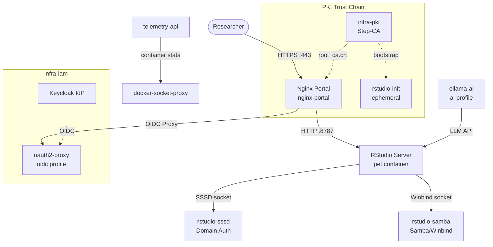

# Infra-RStudio: Botanical Research Computing Portal

This component provides a **container-native RStudio Server** environment for BIOME researchers, secured by Nginx with internal PKI certificates, authenticated via Active Directory (SSSD or Winbind/Samba), and optionally fronted by oauth2-proxy for Keycloak OIDC SSO.

It is a **pet service** — designed to run on a single dedicated host (`rstudio-host`) with direct access to institutional file systems and domain authentication sockets.

---

## Architecture



---

## Why `network_mode: host`

The pet container and its auth sidecars use `network_mode: host`. This is an **architectural exception**, not a bug or misconfiguration.

**Reason**: SSSD and Winbind communicate with the host's PAM stack and domain controller through **Unix domain sockets** inside `/var/run/sssd/` (or `/var/run/samba/`). These paths exist on the host and are bind-mounted into the containers. The containers must be able to reach the host's Kerberos KDC and LDAP/AD endpoints at the host-configured addresses — which are resolved only when the container shares the host's network namespace.

This design follows the established `infra-iam` Caddy pattern and is documented as an accepted deviation in `CLAUDE.md § HC exceptions`.

---

## Services

| Service | Container Name | Profile | Role | Credentials |
| :--- | :--- | :--- | :--- | :--- |
| `rstudio-init` | `rstudio_init` | (always) | Ephemeral init — creates dirs, fetches PKI root CA | — |
| `rstudio-sssd` | `rstudio_sssd` | `sssd` | Domain auth via SSSD + PAM | Host SSSD config must be pre-configured |
| `rstudio-samba` | `rstudio_samba` | `samba` | Domain auth via Winbind/Samba | Host Winbind or Samba config |
| `nginx-portal` | `rstudio_pet` *(health check anchor)* | (always) | TLS termination + reverse proxy | — |
| `telemetry-api` | `rstudio_telemetry` | (always) | Container metrics REST API | Internal only |
| `docker-socket-proxy` | `rstudio_dsp` | (always) | Security proxy for `/var/run/docker.sock` | Internal only |
| `oauth2-proxy` | `rstudio_oauth2` | `oidc` | Keycloak OIDC SSO gate | `CLIENT_SECRET` in `.env` |
| `ollama-ai` | `rstudio_ollama` | `ai` | Local LLM for R coding assistant | GPU on host optional |

---

## Authentication Backend Decision Tree

```
Is the host joined to an Active Directory domain?
├── YES: Is SSSD already configured on the host?
│   ├── YES  → Use profile: sssd   (AUTH_BACKEND=sssd)
│   └── NO   → Use profile: samba  (AUTH_BACKEND=samba, Winbind manages domain join)
└── NO: RStudio will use local Unix accounts only (no domain backend)
```

**Selecting a backend** is done via `.env`:
```dotenv
AUTH_BACKEND=sssd    # or: samba
```

And profile activation at deploy time:
```bash
docker compose --profile sssd --profile portal up -d
# or
docker compose --profile samba --profile portal up -d
```

---

## PKI Trust Chain

```
infra-pki (Step-CA)
  └── root_ca.crt (PEM)
        ├── → rstudio-init  (fetches via CA_URL/roots.pem, verifies CA_FINGERPRINT)
        │     └── installs to /certs/root_ca.crt (shared volume)
        └── → Nginx         (reads /certs/root_ca.crt for client cert verification)
```

Bootstrap sequence:
1. `rstudio-init` starts first (`depends_on` in compose)
2. It calls `manage_pki_trust.sh CA_URL CA_FINGERPRINT`
3. Root CA is installed into the system trust store inside the init container
4. Root CA is copied to the shared `/certs` volume
5. `nginx-portal` and `rstudio-pet` containers start and read certs from `/certs`

---

## Integration Points

| System | Integration | Protocol |
| :--- | :--- | :--- |
| **infra-pki** | Root CA bootstrap (mandatory) | HTTPS to Step-CA `roots.pem` endpoint |
| **infra-iam (Keycloak)** | OIDC SSO via `oauth2-proxy` (optional, `oidc` profile) | HTTPS OIDC/OAuth2 |
| **Active Directory** | User auth via SSSD or Winbind (required for domain users) | LDAPS / Kerberos |
| **NFS / NAS** | User home directories (bind mount on host, transparent) | NFS on host |
| **Open OnDemand (OOD)** | Future: OOD→RStudio proxy integration | HTTPS |
